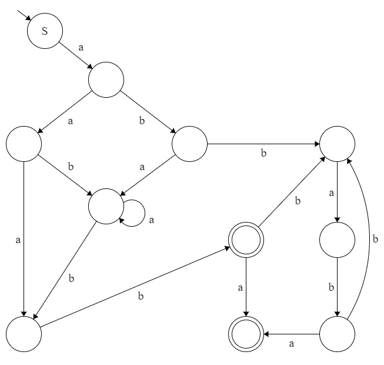

# Automaton → RegEx (15 points)

## Submission mode
- The filename must be `automaton.txt` and should be in [UTF-8 Encoding](https://www.w3.org/International/questions/qa-what-is-encoding.en).
- The regular expression should **NOT** contain any whitespace (that means, no blanks and no line breaks)!
- Please only write the regex in the .txt file.
- Regex should only contain lowercase letters (and no uppercase letters!)

## Assignment description

A (deterministic) finite automaton is given. You'll find the picture of the automaton in the this folder under the name `automaton_regex.png`.
Create a regular expression that matches **exactly** those words that are accepted by this machine. **Keep this regular expression as short as possible.**

## Example:

The automaton from the picture above would, for example, exactly match the following regular expression:

(a+b(bb)*ab)*

## FAQ
---
**Q**: *Can we use the {} Element in this task?*

**A**: You do not need those in this task, but they should be ok, yes.

**Q**: *yy\* means the same as y+, right?*

**A**: Yes. y+ means one or more, yy* means one and 0 or more so basically the same thing whereas you should use y+ as it is a shorter version of yy*.

**Q**: *Are we allowed / might it be necessary to use ^ and $ for beginning and end ?*

**A**: No.

**Q**: *What does mean " Keep this regular expression as short as possible”?*

**A**: Instead of writing aa*, write a+ ; instead of (a+)?, write a*, etc. So, first write down a regex that is equivalent to the automaton, and then try to simplify the regex (there are examples in the lecture slides) as much as possible. But make sure it is still equivalent to the automaton.

**Q**: *What syntax is allowed/is need for this task?*

**A**: Typical RegEx vocabulary for exam:  + * ? | ( )

---

## Changelog
* **2023-12-01 19:30** [ES]: Description init.
