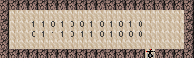
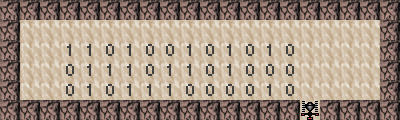

# Marvin: Binary Subtraction (20 Points)

A labyrinth displaying two numbers in binary notation is given.
The two numbers' length is up to 12 bits and both will always have the same amount of bits.
**Leading zeroes are possible** (e.g. decimal 3 in binary as 0011), for more details see the example.
Subtractions that would result in a negative number do not have to be considered (i.e. they will not be tested).

It's your job to help Marvin **subtract the numbers correctly** and **print the result in the line below**.
The **result's length must match the size of the input numbers**.
Marvin must **return back to the entrance** once he is done with his calculations!
In order to do this, you have to update the [`subtract.txt`](subtract.txt) file with your marvin rules (which you can export via `Expertenmodus` -> `Regelsatz editieren`).

Your program **must work for all numbers of 1-12 bits** that encode a subtraction yielding a non-negative result!

## Labyrinth

The **labyrinth size, marvin's start position and the binary numbers' rightmost bits' locations will always stay the same**.
However, the **numbers and their lengths will change** (but both numbers will always have the same length)!
To use the correct labyrinth run `Marvin.jar` and click on `Expertenmodus` -> `Labyrinth editieren`.
Overwrite its content with the following and then click on Labyrinth übernehmen.
```
<?xml version="1.0" encoding="iso-8859-1"?>
<!DOCTYPE LabyrinthLevel SYSTEM "LabyrinthLevel.dtd">
<LabyrinthLevel>
  <Name> Labyrinth Subtraction </Name>
  <Dimension>
    <width> 20 </width>
    <height> 6 </height>
  </Dimension>
  <Labyrinth>
    <StartSymbol> S </StartSymbol>
    <WallSymbol> W </WallSymbol>
    <DiamondSymbol> D </DiamondSymbol>
    <WaySymbol> . </WaySymbol>
    <ZeroSymbol> 0 </ZeroSymbol>
    <OneSymbol> 1 </OneSymbol>
    <TwoSymbol> 2 </TwoSymbol>
    <ThreeSymbol> 3 </ThreeSymbol>
    <StartingDirection> UP </StartingDirection>
    <LabyrinthField>
WWWWWWWWWWWWWWWWWWWW
W..................W
W..110100101010....W
W..011101101000....W
W..................W
WWWWWWWWWWWWWWWSWWWW
    </LabyrinthField>
  </Labyrinth>
</LabyrinthLevel>
```
([`subtract_labyrinth.txt`](subtract_labyrinth.txt) contains this text.)

## Ruleset

To write new rules for Marvin click on `Expertenmodus` -> `Regelsatz editieren`.
Now you can write rules (or //comments) and to apply the new ruleset click on `Regelsatz übernehmen`.  
To let Marvin loose press `Neustart` and adjust the speed to your liking by moving the `Geschwindigkeit` slider.

Save your ruleset - that lets marvin perform this task - in the [`subtract.txt`](subtract.txt) file.

## Example

Initial labyrinth:


Final labyrinth:


## Hints
* [Binary subtraction on Wikipedia](https://en.wikipedia.org/wiki/Binary_number#Subtraction)
* Test your program with other numbers
* Think about all possible cases that Marvin can encounter and try to build and organize your rules around those
